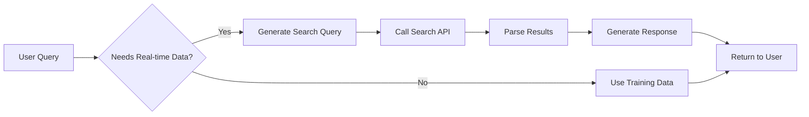

# SearchSage

> Have you ever wondered how ChatGPT retrieves real-time information from the web? 

SearchSage demystifies this process by implementing a powerful web search integration system that enables AI assistants to access live information from the internet, just like modern conversational AI systems do.

## The Problem

Traditional AI models are limited by their training data cutoff dates. They can't tell you:
- Today's weather
- Latest news headlines  
- Current stock prices
- Real-time sports scores
- Recent scientific discoveries

But ChatGPT and similar systems somehow know about current events. How?

## The Solution
[Live Demo](https://searchsageweb.streamlit.app/)

SearchSage reveals the magic behind real-time AI responses by implementing the same core concept: **Function Calling + Web Search APIs**. 

When you ask ChatGPT "What's the weather like today?", it doesn't actually "know" the weather. Instead, it:

1. **Recognizes** that your question requires real-time data
2. **Calls** a search function to query the web
3. **Processes** the search results 
4. **Generates** a natural language response based on the findings

SearchSage implements this exact workflow, giving you the power to build AI assistants that can access live information.

## Features

- **Real-time Web Search**: Integrate live web data into your AI responses
- **Intelligent Query Processing**: Automatically determine when web search is needed
- **Result Parsing**: Extract and structure relevant information from search results
- **Context-Aware Responses**: Generate natural language responses based on search findings
- **Caching System**: Optimize performance with intelligent result caching
- **Rate Limiting**: Respect API limits and implement proper throttling

## How It Works




## Understanding the Magic

Here's what happens behind the scenes when you ask ChatGPT about current events:

1. **Intent Recognition**: The AI analyzes your query to determine if it requires real-time information
2. **Query Optimization**: It reformulates your question into an effective search query
3. **API Call**: Makes a request to search APIs (Google, Bing, etc.)
4. **Result Processing**: Extracts relevant information from search results
5. **Response Generation**: Synthesizes findings into a natural, conversational response

SearchSage implements each of these steps, giving you the building blocks to create your own real-time AI assistant.

## Examples

### Weather Query
```
User: "What's the weather like in Tokyo today?"
SearchSage: *searches web* → "It's currently 22°C and sunny in Tokyo with light winds..."
```

### News Query  
```
User: "Any recent developments in space exploration?"
SearchSage: *searches web* → "NASA recently announced the successful deployment of..."
```

### Stock Query
```
User: "How is Tesla stock performing today?"
SearchSage: *searches web* → "Tesla (TSLA) is currently trading at $245.67, up 2.3%..."
```

## Contributing

We welcome contributions! Here's how you can help:

1. **Fork** the repository
2. **Create** a feature branch (`git checkout -b feature/amazing-feature`)
3. **Commit** your changes (`git commit -m 'Add amazing feature'`)
4. **Push** to the branch (`git push origin feature/amazing-feature`)
5. **Open** a Pull Request

## License

This project is licensed under the MIT License - see the [LICENSE](LICENSE) file for details.

## Acknowledgments

- OpenAI for pioneering function calling in AI systems
- DuckDuckGo for their search APIs
- The open-source community for inspiration and contributions

---

**Ready to give your AI real-time superpowers?** Start with SearchSage and unlock the same capabilities that make ChatGPT so powerful! 🚀
